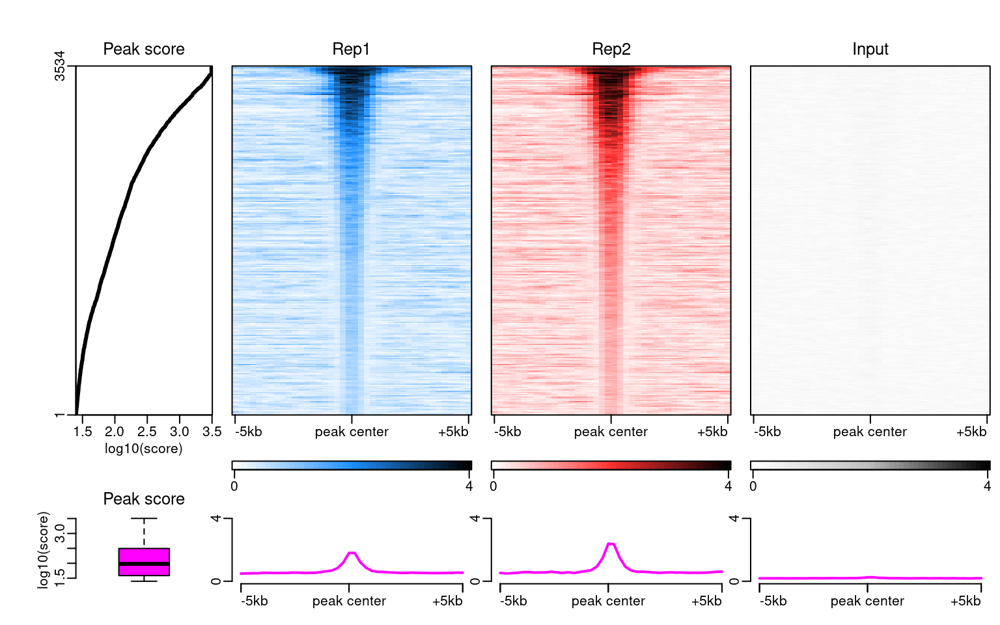
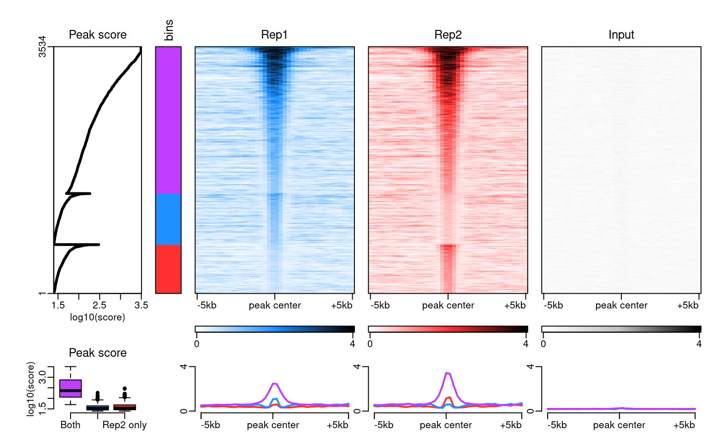
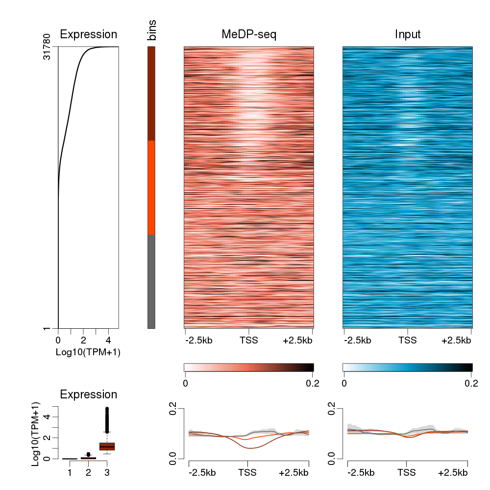
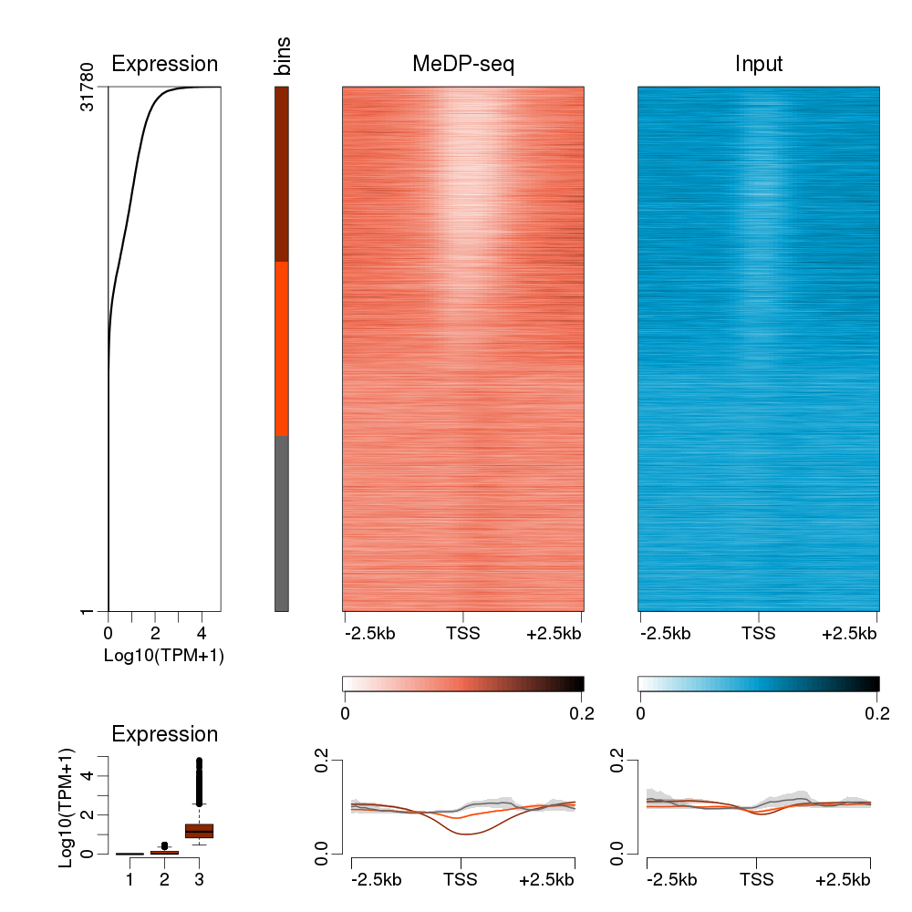
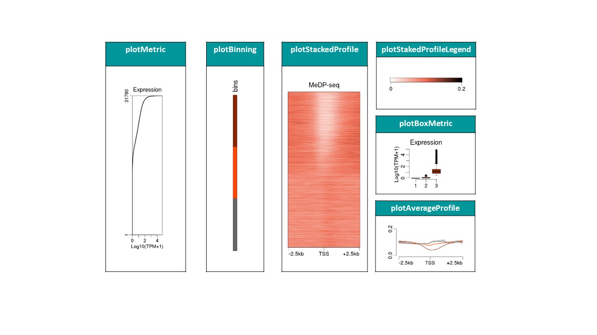

class: inverse, center, middle, font180,

```{r setup, include=FALSE}
#options(htmltools.dir.version = FALSE)
 library(knitr)
 opts_chunk$set(cache = TRUE, cache.lazy = FALSE)


library(GenomicRanges)
library(epistack)

```

# Epistack
.font140[
Un package R de visualisation de signaux génomiques
]

SACI Safia - DEVAILLY Guillaume

12/07/2021
.bottom[
]

---

layout: true
background-image: url("INRAE_genphyse_logo.svg")
background-position: bottom left
background-size: 20%

---
class: top, left, font140

# Epistack

#### Un package de visualisation de profils épigénétiques centrés sur une liste de régions génomiques

* Promoteurs de gènes
* Sommets de pics
* Ilots CpG
* ...


--

.pull-left[
#### Epistack nous permets une: 

- visualisation informative
- utilisation simple 
- grande flexibilité
- limitation du problème d’overplotting

]
--

.pull-right[

#### Entrées d'Epistack:

- Une ou plusieurs pistes épigénétiques :  
`.bam`, `.bigwig`, ...
- Une liste de régions d'intérêts :  
`.gtf`, `.bed`, ...
- Un score pour trier les profils :  
expression des gènes, score des pics, résultat de clustering, ...

]
---

# Exemple d'utilisation 

### Instalation
```{r install, eval=FALSE}
remotes::install_github("GenEpi-GenPhySE/epistack")
library(epistack)

```

.pull-left[
### Fichier d'entrée

.font70[

```{r input, echo=FALSE, collapse=TRUE}

merged_peaks <- readRDS("merged_peaks.RDS")
merged_peaks[1:6, c(4, 5, 6)]
```

```{r taille  }
dim(mcols(merged_peaks))
```

```{r plotEpistack, eval=FALSE}
plotEpistack(merged_peaks, patterns = c("Rep1", "Rep2", "input"), ...)
```
]
]

.pull-right[
### Résultat : Réplicats de ChIP-seq

]

---

.pull-left[
### Fichier d'entrée avec `bin`

.font70[

```{r input2, echo=FALSE, collapse=TRUE}
merged_peaks <- merged_peaks[order(
  merged_peaks$bin, merged_peaks$mean_scores,
  decreasing = c(TRUE, FALSE), method = "radix"
), ]

merged_peaks[1:6, c(125, 4, 5)]
```

```{r plotEpistack2, eval=FALSE}
plotEpistack(merged_peaks, patterns = c("Rep1", "Rep2", "input"), ...)
```

]
]

.pull-right[
### Résultat : Réplicats de ChIP-seq

]

---
class: top, left

# Overplotting


Une particularité d'Epistack : Limitation du problème d'overplotting  
▶️ réduire la taille des matrices juste avant le plot.  
Pour en savoir plus: [bioinfo-fr.net/creer-des-heatmaps-a-partir-de-grosses-matrices-en-r](https://bioinfo-fr.net/creer-des-heatmaps-a-partir-de-grosses-matrices-en-r)
.pull-left[
Comportement R par défaut :

]

.pull-left[
Comportement Epistack par défaut :


]

---
class: left

# Les fonctions individuelles de visualisation

.center[
]


---

background-image: url("galerie.jpg")
background-position: top
background-size: 100%

---
class: inverse, top, font130

* Epistack est une altérnative à `{EnrichedHeatmap}`, `{seqPlots}`, ou deepTools et seqMINER.

* Epistack est disponible sur : [github.com/GenEpi-GenPhySE/epistack](https://github.com/GenEpi-GenPhySE/epistack.git).

* Bientôt soumit à Bioconductor.

* Epistack a servi pour le développement de l'application [PEREpigenomics](https://joshiapps.cbu.uib.no/perepigenomics_app/).

  
  
 ________________________________
.center[.font200[Merci Pour votre attention]]